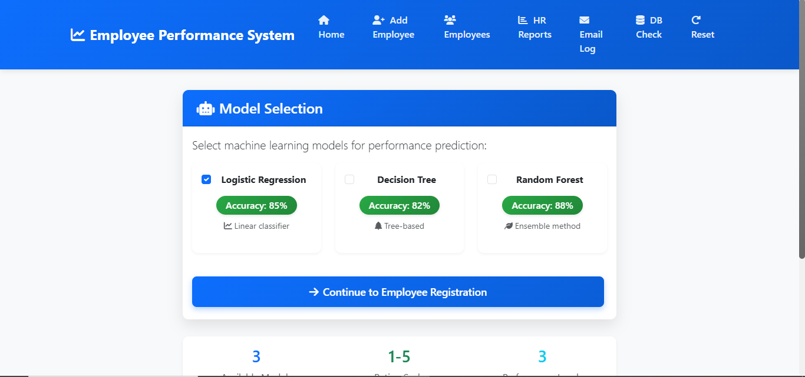
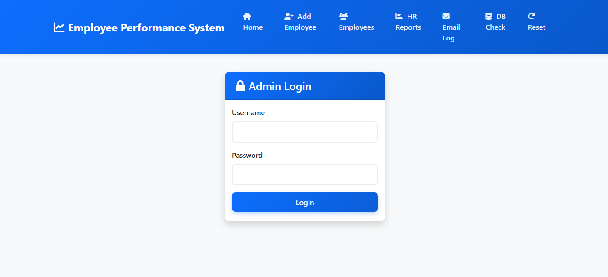

# Employee Performance Management Using AI

## 📌 Overview

Employee Performance Management Using AI is a web-based application developed using Flask and MySQL. The system helps organizations evaluate employee performance through team leader assessments and HR analysis.

## 🚀 Features

- Employee Registration
- Team Leader Evaluation
- HR Performance Analysis
- Automated Performance Scoring
- Email Notifications
- Employee Reports Dashboard

## 🛠 Technologies Used

- Python
- Flask
- MySQL
- HTML5
- CSS3
- Machine Learning

---

## 📸 Screenshots

| 🏠 Home Page | 🔐 Admin Login |
|--------------|----------------|
|  |  |

---

## ⚙️ Installation

```bash
pip install -r requirements.txt
python app.py
```

---

## 🗄 Database

Import the database:

```sql
db.sql
```

---

## 💡 How It Works

1. Register employees in the system.
2. Team leaders evaluate employee performance.
3. HR reviews and analyzes evaluation reports.
4. AI generates performance scores and insights.
5. Reports are displayed on the dashboard, and notifications are sent to employees.

---

## 👨‍💻 Developed By

**Indra Institute of Education**

Student AI Project

---
